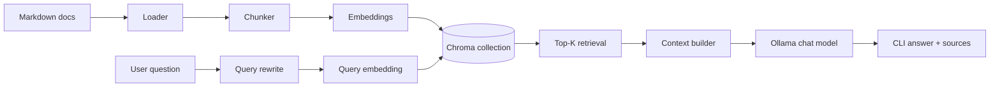
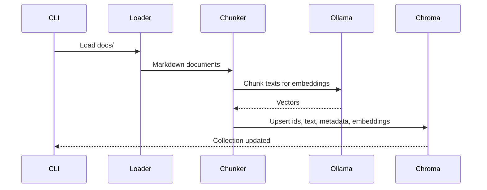
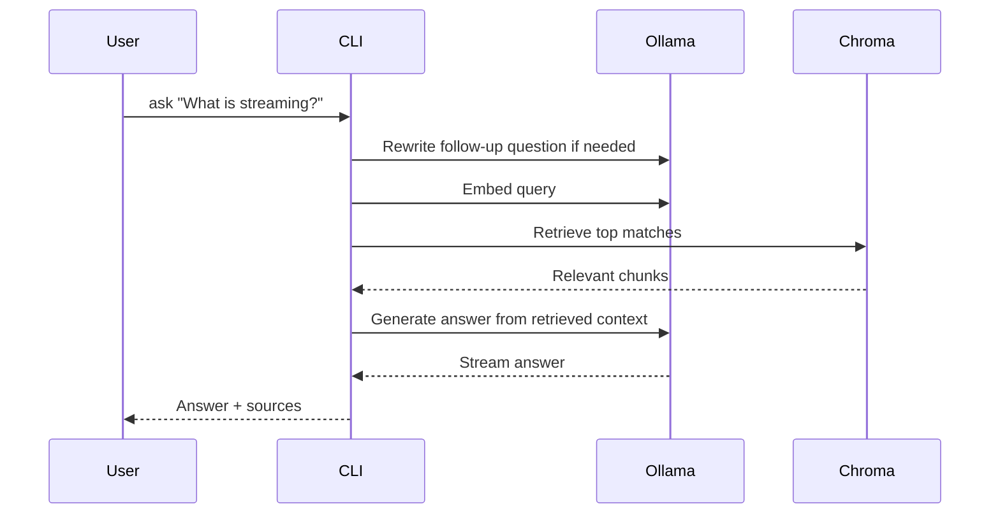

# dev-docs

A local RAG playground for developer documentation.

It loads Markdown files from `docs/`, chunks them, embeds them with Ollama, stores vectors in Chroma, retrieves the most relevant chunks, and answers in the CLI with source references.

## Architecture



## Ingestion flow



## Query flow



## Stack

- TypeScript
- [`ai`](https://www.npmjs.com/package/ai)
- [`ai-sdk-ollama`](https://www.npmjs.com/package/ai-sdk-ollama)
- [`chromadb`](https://www.npmjs.com/package/chromadb)
- Ollama
- local Markdown docs in `docs/`

## Requirements

- [Node.js](https://nodejs.org/)
- [pnpm](https://pnpm.io/installation)
- [Ollama](https://ollama.com/download)

## Project structure

```text
src/
  app.ts                 CLI command orchestration
  chat/                  Prompt and history helpers
  chroma/                Chroma client and collections
  cli/                   Console output helpers
  context/               Retrieved context assembly
  embeddings/            Embedding generation
  evaluation/            Retrieval evaluation cases
  ingest/                Document loading and chunking
  llm/                   Query rewrite and answer streaming
  ollama/                Ollama model setup
  query/                 Retrieval pipeline
  services/              High-level use cases
  types/                 Shared types
  utils/                 Small utility helpers

docs/                    Source documents used for RAG
```

## Install

```sh
pnpm install
```

## Ollama setup

Pull the default models:

```sh
ollama pull nomic-embed-text
ollama pull gemma4:e2b
```

## Configuration

Runtime configuration is validated from environment variables in `src/config.ts`.

Start from:

```sh
cp .env.example .env
```

Available settings:

| Variable | Default | Description |
| --- | --- | --- |
| `DOCS_PATH` | `docs` | Directory containing Markdown docs |
| `CHROMA_COLLECTION_NAME` | `documentation` | Chroma collection name |
| `EMBEDDING_MODEL` | `nomic-embed-text:latest` | Ollama embedding model |
| `CHAT_MODEL` | `gemma4:e2b` | Ollama chat model |
| `MAX_CHUNK_SIZE` | `200` | Target chunk size |
| `TOP_K` | `5` | Max retrieved chunks |
| `RETRIEVAL_THRESHOLD` | `0.9` | Distance cutoff for keeping matches |

This makes it easier to run different environments without changing source code.

## Getting started

### 1. Ingest the docs

```sh
pnpm start ingest
```

You will see loading steps for document loading, chunking, embedding, and storage.

### 2. Ask a question

```sh
pnpm start ask "What is streaming?"
```

### 3. Start chat mode

```sh
pnpm start chat
```

### 4. Run retrieval evaluation

```sh
pnpm start evaluate
```

### 5. Run integration tests

```sh
pnpm test
```

## Available commands

| Command | What it does |
| --- | --- |
| `pnpm start ingest` | Loads docs, chunks them, embeds them, and stores them in Chroma |
| `pnpm start ask "..."` | Retrieves relevant chunks and streams an answer |
| `pnpm start chat` | Opens an interactive CLI chat loop |
| `pnpm start evaluate` | Runs retrieval checks from `src/evaluation/test-cases.ts` |
| `pnpm build` | Compiles TypeScript to `dist/` |
| `pnpm typecheck` | Runs TypeScript type checking |
| `pnpm test` | Runs integration tests |

## Example session

Ingest:

```sh
pnpm start ingest
```

Ask:

```sh
pnpm start ask "How does retrieval improve answers?"
```

Expected CLI flow:

- retrieval starts with a loading message
- matching chunks are listed
- the answer is streamed to stdout
- source chunks are printed at the end

## Troubleshooting

### Ollama model not found

Pull the missing model manually:

```sh
ollama pull nomic-embed-text
ollama pull gemma4:e2b
```

### No relevant documentation found

Try rephrasing the question or re-run ingestion:

```sh
pnpm start ingest
```

### Docs directory cannot be read

Check `DOCS_PATH` in `.env` and make sure it points to a folder containing `.md` files.

### Type errors

```sh
pnpm typecheck
```

### Chroma data looks stale

Remove generated Chroma artifacts and ingest again.

Typical local artifacts include:

- `getting-started/`
- `chroma.sqlite3`

Then rerun:

```sh
pnpm start ingest
```

## Notes

- Answers are constrained to retrieved context.
- Retrieval evaluation cases live in `src/evaluation/test-cases.ts`.
- This is still a local playground, but the config validation is set up to be safer for production-style runs.

## License

ISC
