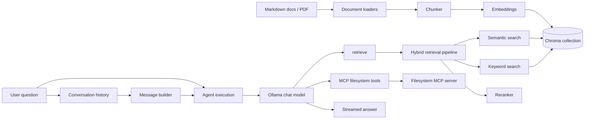

# dev-docs

> 🚧 **Project Status:** This project is currently under active development and is continuously evolving with new features, architectural improvements, and production-ready capabilities.

Dev Docs is a developer-focused **Retrieval-Augmented Generation (RAG)** assistant built with **TypeScript**, **Vercel AI SDK**, **Ollama**, and **ChromaDB**. It is designed as a practical reference project for building documentation assistants that feel closer to real production systems: documents are ingested into a vector store, questions are answered with tool-using LLM workflows, retrieval can be inspected and reranked, and the whole system can be evaluated end to end.

Today, the CLI can:

- ingest Markdown documentation from `docs/`
- ingest a single PDF from a file path
- answer questions with an Ollama-backed assistant
- stream responses while the model calls retrieval and MCP filesystem tools
- inspect keyword-only and reranked hybrid retrieval output
- run retrieval-level and answer-level evaluations

## Architecture



## Current capabilities

Right now, the project has these core capabilities:

- **Hybrid retrieval:** combines semantic search from Chroma with keyword scoring over stored chunks
- **Pluggable reranking:** supports `weighted-score`, `rrf`, and a scaffolded `cross-encoder` mode through `RERANKER`
- **Retrieval pipeline outputs:** can return reranked chunk results for debugging or grouped document-style results for tools
- **Streaming answers:** responses stream in real time in both single-question and chat flows
- **Tool-enabled generation:** the model can call the built-in `retrieve` tool while answering
- **MCP integration:** filesystem tools are loaded dynamically through `mcp-server-filesystem`
- **Lifecycle cleanup:** the MCP client is closed automatically when the app exits
- **Retrieval inspection:** the `hybrid` command prints semantic, keyword, and rerank scores for each result
- **Mixed-source ingestion:** Markdown and PDF content can be ingested into the same Chroma-backed knowledge base
- **Evaluation support:** retrieval and answer evaluation flows help verify source coverage and answer quality
- **Session controls:** chat history can be reset with `/clear`

In short, the app already behaves like a tool-using RAG assistant with inspectable retrieval, configurable reranking, streamed answers, and MCP-powered extensibility.

## Stack

- TypeScript
- [`ai`](https://www.npmjs.com/package/ai)
- [`ai-sdk-ollama`](https://www.npmjs.com/package/ai-sdk-ollama)
- [`chromadb`](https://www.npmjs.com/package/chromadb)
- [`@ai-sdk/mcp`](https://www.npmjs.com/package/@ai-sdk/mcp)
- [`@modelcontextprotocol/sdk`](https://www.npmjs.com/package/@modelcontextprotocol/sdk)
- [`pdf-parse`](https://www.npmjs.com/package/pdf-parse)
- [`zod`](https://www.npmjs.com/package/zod)
- Ollama

## Requirements

- [Node.js](https://nodejs.org/)
- [pnpm](https://pnpm.io/installation)
- [Ollama](https://ollama.com/download)

## Project structure

```text
src/
  agent/                 Agent execution entrypoints
  chat/                  Prompt building and conversation history
  chroma/                Chroma client, collections, and storage
  cli/                   Console output helpers
  embeddings/            Embedding generation for docs and queries
  evaluation/            Retrieval and answer evaluation runners
  filesystem/            File listing helpers for docs/
  ingest/                Chunking and document loaders
  llm/                   Shared LLM options and answer streaming
  ollama/                Ollama model setup
  mcp/                   MCP client setup and tool loading
  query/                 Semantic, keyword, hybrid, and reranking retrieval
  repository/            Full document reads for Markdown and PDF
  services/              High-level ask, answer, and ingest flows
  tools/                 Model-exposed tools
  tracing/               Tracing scaffolds for future instrumentation
  types/                 Shared domain types
  utils/                 Small utility helpers

docs/                    Markdown knowledge base
knowledge/pdfs/          Local PDFs readable by repository tools
```

## Tooling available to the agent

| Tool family | Purpose |
| --- | --- |
| `retrieve` | Returns relevant documentation content from the retrieval pipeline |
| MCP filesystem tools | Loaded at runtime from `mcp-server-filesystem`, giving the model access to filesystem-backed MCP tools |

Model instructions live in `src/chat/instructions.ts`, and shared model settings live in `src/llm/options.ts`.

## Retrieval pipeline

The retrieval flow now has separate steps:

1. `semanticSearch()` retrieves vector matches from Chroma through `queryChroma()`
2. `keywordSearch()` scores literal term matches across stored chunks
3. `hybridSearch()` merges semantic and keyword results into shared `SearchResult` records
4. the configured reranker scores and sorts the merged results
5. `groupChunks()` can combine adjacent chunks from the same source into document-like outputs for tools

This gives the app two useful views of retrieval: low-level scored results for debugging, and cleaner document-shaped outputs for downstream tool use.

## Ingestion

### Markdown

```sh
pnpm start ingest
```

Equivalent to:

```sh
pnpm start ingest markdown
```

### PDF

```sh
pnpm start ingest pdf ./knowledge/pdfs/handbook.pdf
```

PDF ingestion uses `PdfLoader` and stores the extracted text as chunks in Chroma.

## Ollama setup

Pull the default models:

```sh
ollama pull nomic-embed-text
ollama pull gemma4:e2b
```

## Configuration

Start from:

```sh
cp .env.example .env
```

Runtime configuration is validated in `src/config.ts`.

| Variable                 | Default                   | Description                                  |
| ------------------------ | ------------------------- | -------------------------------------------- |
| `DOCS_PATH`              | `docs`                    | Directory containing Markdown docs           |
| `CHROMA_COLLECTION_NAME` | `documentation`           | Chroma collection name                       |
| `EMBEDDING_MODEL`        | `nomic-embed-text:latest` | Ollama embedding model                       |
| `CHAT_MODEL`             | `gemma4:e2b`              | Ollama chat model                            |
| `MAX_CHUNK_SIZE`         | `200`                     | Target chunk size                            |
| `TOP_K`                  | `5`                       | Max retrieved chunks                         |
| `RETRIEVAL_THRESHOLD`    | `0.9`                     | Distance cutoff for semantic retrieval       |
| `MAX_HISTORY_TURNS`      | `5`                       | Number of user turns to keep in chat history |
| `RERANKER`               | `weighted-score`          | Retrieval reranker: `weighted-score`, `rrf`, or `cross-encoder` |

Note: `cross-encoder` is scaffolded in the codebase but not implemented yet.

## Usage

### Ask one question

```sh
pnpm start ask "What is streaming?"
```

### Start chat mode

```sh
pnpm start chat
```

Chat commands:

- `exit` — quit
- `/clear` — clear conversation history

### Run evaluations

```sh
pnpm start evaluate
pnpm start evaluate retrieval
pnpm start evaluate answers
```

### Debug retrieval modes

```sh
pnpm start keyword "semantic search"
pnpm start hybrid "semantic search"
```

## Available commands

| Command                         | What it does                              |
| ------------------------------- | ----------------------------------------- |
| `pnpm start ingest`             | Ingests Markdown docs from `docs/`        |
| `pnpm start ingest markdown`    | Explicit Markdown ingestion               |
| `pnpm start ingest pdf <path>`  | Ingests one PDF file                      |
| `pnpm start ask "..."`          | Generates an answer for a single question |
| `pnpm start chat`               | Starts interactive chat mode              |
| `pnpm start keyword "..."`      | Runs keyword-only retrieval               |
| `pnpm start hybrid "..."`       | Runs hybrid retrieval                     |
| `pnpm start evaluate`           | Runs retrieval and answer evaluations     |
| `pnpm start evaluate retrieval` | Runs retrieval-only evaluation            |
| `pnpm start evaluate answers`   | Runs answer-content evaluation            |
| `pnpm build`                    | Compiles TypeScript to `dist/`            |
| `pnpm typecheck`                | Runs TypeScript type checking             |
| `pnpm test`                     | Runs integration tests                    |

## Evaluation

Evaluation cases live in `src/evaluation/test-cases.ts`.

There are two evaluation paths:

- **retrieval evaluation** checks whether the expected source documents are returned
- **answer evaluation** checks whether generated answers contain the expected content

Reports are printed through `src/evaluation/report.ts`.

## Troubleshooting

### Ollama model not found

```sh
ollama pull nomic-embed-text
ollama pull gemma4:e2b
```

### No relevant documentation found

Re-run ingestion:

```sh
pnpm start ingest
```

### PDF ingestion fails

Confirm the file path exists and is readable, then retry:

```sh
pnpm start ingest pdf ./path/to/file.pdf
```

### Docs directory cannot be read

Check `DOCS_PATH` in `.env` and make sure it points to a folder containing `.md` files.

### Type errors

```sh
pnpm typecheck
```

## Notes

- answers are generated from tool results and retrieved documentation
- full document reads are handled through `src/repository/document-repository.ts`
- reranked hybrid retrieval powers the built-in `retrieve` flow
- some files are intentionally scaffolded for future MCP, tracing, and reranker expansion

## License

ISC
