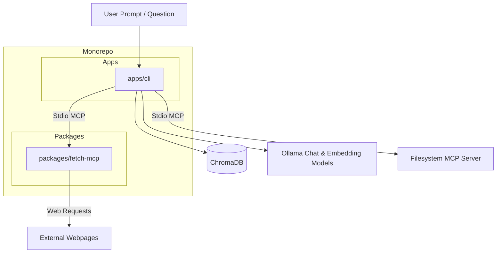

# dev-docs

Developer-focused **Retrieval-Augmented Generation (RAG)** documentation assistant and MCP tool suite, organized as a `pnpm` monorepo.

Dev Docs combines vector search with ChromaDB, hybrid keyword/semantic reranking, Ollama-backed LLMs, and Model Context Protocol (MCP) integrations for filesystem access and webpage fetching.

## Workspace Layout

- `apps/cli` — RAG documentation assistant CLI app (Ollama, ChromaDB, hybrid retrieval, answer evaluation, PDF/Markdown ingestion)
- `packages/fetch-mcp` — MCP server (`@dev-docs/fetch-mcp`) exposing the `fetch_url` tool to fetch web pages, sanitize HTML, adhere to robots.txt, and extract clean Markdown
- `docs` — Repository-level workspace documentation

## Getting Started

### Prerequisites

- [Node.js](https://nodejs.org/) (v20+)
- [pnpm](https://pnpm.io/) (v11+)
- [Ollama](https://ollama.com/) with models pulled:
  ```sh
  ollama pull nomic-embed-text
  ollama pull gemma4:e2b
  ```

### Installation & Build

```sh
# Install dependencies
pnpm install

# Build all workspace packages
pnpm build

# Typecheck workspace packages
pnpm typecheck
```

## Environment Setup

Create `.env` inside `apps/cli/`:

```sh
cp apps/cli/.env.example apps/cli/.env
```

## Usage Commands

Run workspace commands directly from the repository root:

| Command | Action |
| --- | --- |
| `pnpm chat` | Start interactive terminal chat with doc retrieval & MCP tools |
| `pnpm cli ask "..."` | Ask a single question via CLI |
| `pnpm ingest` | Ingest Markdown documentation from `docs/` into ChromaDB |
| `pnpm cli ingest pdf <path>` | Ingest a PDF document into ChromaDB |
| `pnpm evaluate` | Run retrieval and answer quality evaluations |
| `pnpm chroma` | Start local ChromaDB vector database |
| `pnpm build` | Compile TypeScript across all workspace projects |
| `pnpm typecheck` | Run type checking across all workspace projects |
| `pnpm test` | Run workspace tests |

## Architecture & MCP Integration



- **RAG & Hybrid Search:** Blends vector search (Chroma) with term-frequency keyword matching and configurable rerankers (`weighted-score`, `rrf`, `cross-encoder`).
- **Tool-Calling Agent:** The LLM dynamically invokes retrieval tools and stdio MCP servers (filesystem and fetch-mcp) to answer complex queries.
- **Fetch MCP Server (`@dev-docs/fetch-mcp`):** Formats web content into clean, sanitized Markdown while respecting site `robots.txt` policies.

For detailed application configuration and CLI features, see [`apps/cli/README.md`](apps/cli/README.md).
For Fetch MCP server details, see [`packages/fetch-mcp/README.md`](packages/fetch-mcp/README.md).

## License

ISC

