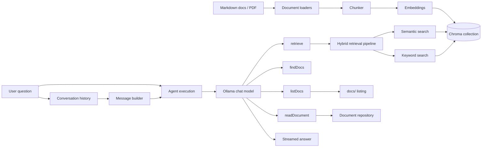

# dev-docs

A local RAG playground for developer documentation with tool-augmented chat, hybrid retrieval, and basic evaluation workflows.

The CLI can:

- ingest Markdown docs from `docs/`
- ingest a single PDF from a file path
- answer questions with an Ollama-backed agent
- use tools to list docs, find relevant docs, read full documents, and retrieve supporting content
- run retrieval-only or answer-level evaluations

## Architecture



## What changed in this version

This codebase now centers around reusable services and pipelines instead of one-off helpers:

- ingestion moved to loader-based services
- PDF ingestion was added via `pdf-parse`
- retrieval now supports a hybrid semantic + keyword flow
- retrieved chunks can be grouped back into document-shaped results for tools
- answer generation was extracted into `generateAnswer()`
- evaluation now supports retrieval checks and answer-content checks
- chat adds `/clear` to reset history

## Stack

- TypeScript
- [`ai`](https://www.npmjs.com/package/ai)
- [`ai-sdk-ollama`](https://www.npmjs.com/package/ai-sdk-ollama)
- [`chromadb`](https://www.npmjs.com/package/chromadb)
- [`pdf-parse`](https://www.npmjs.com/package/pdf-parse)
- [`zod`](https://www.npmjs.com/package/zod)
- Ollama

## Requirements

- [Node.js](https://nodejs.org/)
- [pnpm](https://pnpm.io/installation)
- [Ollama](https://ollama.com/download)

## Project structure

```text
src/
  agent/                 Agent execution entrypoints
  chat/                  Prompt building and conversation history
  chroma/                Chroma client, collections, and storage
  cli/                   Console output helpers
  embeddings/            Embedding generation for docs and queries
  evaluation/            Retrieval and answer evaluation runners
  filesystem/            File listing helpers for docs/
  ingest/                Chunking and document loaders
  llm/                   Shared LLM options and answer streaming
  ollama/                Ollama model setup
  query/                 Semantic, keyword, and hybrid retrieval
  repository/            Full document reads for Markdown and PDF
  services/              High-level ask, answer, and ingest flows
  tools/                 Model-exposed tools
  types/                 Shared domain types
  utils/                 Small utility helpers

docs/                    Markdown knowledge base
knowledge/pdfs/          Local PDFs readable by repository tools
```

## Tooling available to the agent

| Tool | Purpose |
| --- | --- |
| `listDocs` | Lists available Markdown documents from `docs/` |
| `findDocs` | Returns documentation files relevant to a query |
| `readDocument` | Reads a full Markdown or PDF document |
| `retrieve` | Returns relevant documentation content via the retrieval pipeline |

The model instructions live in `src/chat/instructions.ts`, and shared model settings live in `src/llm/options.ts`.

## Retrieval pipeline

The retrieval flow now has separate steps:

1. `semanticSearch()` retrieves vector matches from Chroma
2. `keywordSearch()` scores literal term matches across stored chunks
3. `hybridSearch()` merges and ranks both result sets
4. `groupChunks()` combines adjacent chunks from the same source into document-like outputs for tools

This makes tool responses easier to consume than raw chunk lists alone.

## Ingestion

### Markdown

```sh
pnpm start ingest
```

Equivalent to:

```sh
pnpm start ingest markdown
```

### PDF

```sh
pnpm start ingest pdf ./knowledge/pdfs/handbook.pdf
```

PDF ingestion uses `PdfLoader` and stores the extracted text as chunks in Chroma.

## Ollama setup

Pull the default models:

```sh
ollama pull nomic-embed-text
ollama pull gemma4:e2b
```

## Configuration

Start from:

```sh
cp .env.example .env
```

Runtime configuration is validated in `src/config.ts`.

| Variable | Default | Description |
| --- | --- | --- |
| `DOCS_PATH` | `docs` | Directory containing Markdown docs |
| `CHROMA_COLLECTION_NAME` | `documentation` | Chroma collection name |
| `EMBEDDING_MODEL` | `nomic-embed-text:latest` | Ollama embedding model |
| `CHAT_MODEL` | `gemma4:e2b` | Ollama chat model |
| `MAX_CHUNK_SIZE` | `200` | Target chunk size |
| `TOP_K` | `5` | Max retrieved chunks |
| `RETRIEVAL_THRESHOLD` | `0.9` | Distance cutoff for semantic retrieval |
| `MAX_HISTORY_TURNS` | `5` | Number of user turns to keep in chat history |

## Usage

### Ask one question

```sh
pnpm start ask "What is streaming?"
```

### Start chat mode

```sh
pnpm start chat
```

Chat commands:

- `exit` — quit
- `/clear` — clear conversation history

### Run evaluations

```sh
pnpm start evaluate
pnpm start evaluate retrieval
pnpm start evaluate answers
```

### Debug retrieval modes

```sh
pnpm start keyword "semantic search"
pnpm start hybrid "semantic search"
```

## Available commands

| Command | What it does |
| --- | --- |
| `pnpm start ingest` | Ingests Markdown docs from `docs/` |
| `pnpm start ingest markdown` | Explicit Markdown ingestion |
| `pnpm start ingest pdf <path>` | Ingests one PDF file |
| `pnpm start ask "..."` | Generates an answer for a single question |
| `pnpm start chat` | Starts interactive chat mode |
| `pnpm start keyword "..."` | Runs keyword-only retrieval |
| `pnpm start hybrid "..."` | Runs hybrid retrieval |
| `pnpm start evaluate` | Runs retrieval and answer evaluations |
| `pnpm start evaluate retrieval` | Runs retrieval-only evaluation |
| `pnpm start evaluate answers` | Runs answer-content evaluation |
| `pnpm build` | Compiles TypeScript to `dist/` |
| `pnpm typecheck` | Runs TypeScript type checking |
| `pnpm test` | Runs integration tests |

## Evaluation

Evaluation cases live in `src/evaluation/test-cases.ts`.

There are now two evaluation paths:

- retrieval evaluation checks whether required source documents are retrieved
- answer evaluation checks whether generated answers contain expected phrases

Reports are printed through `src/evaluation/report.ts`.

## Troubleshooting

### Ollama model not found

```sh
ollama pull nomic-embed-text
ollama pull gemma4:e2b
```

### No relevant documentation found

Re-run ingestion:

```sh
pnpm start ingest
```

### PDF ingestion fails

Confirm the file path exists and is readable, then retry:

```sh
pnpm start ingest pdf ./path/to/file.pdf
```

### Docs directory cannot be read

Check `DOCS_PATH` in `.env` and make sure it points to a folder containing `.md` files.

### Type errors

```sh
pnpm typecheck
```

## Notes

- answers are generated from tool results and retrieved documentation
- full document reads are handled through `src/repository/document-repository.ts`
- hybrid retrieval is used by both `retrieve` and `findDocs`
- some scaffold files exist for future agent and loader expansion

## License

ISC
