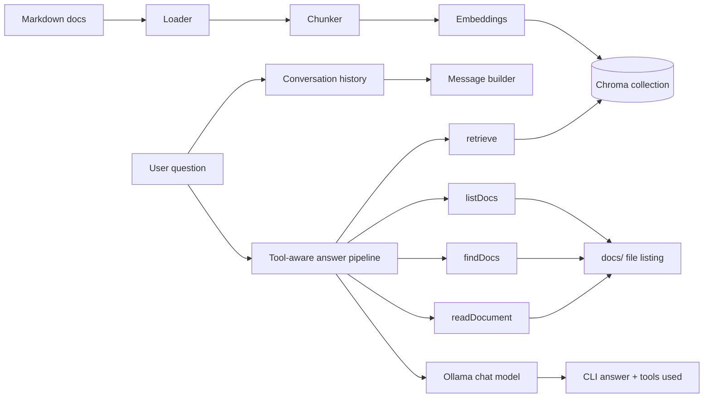
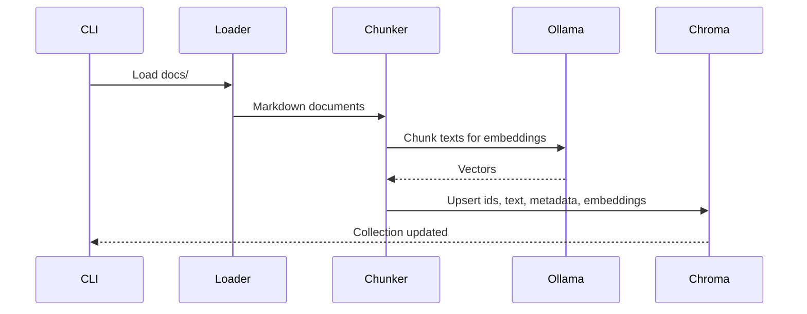
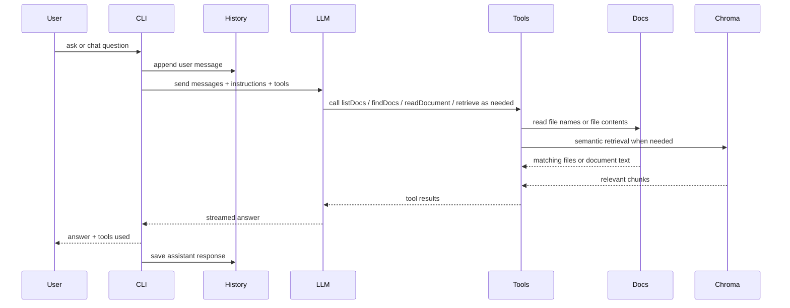

# dev-docs

A local RAG playground for developer documentation with tool-augmented chat.

It loads Markdown files from `docs/`, chunks them, embeds them with Ollama, stores vectors in Chroma, retrieves the most relevant chunks, and answers in the CLI with source references. The chat assistant can now also use explicit documentation tools to list files, find matching filenames, read full documents, and retrieve relevant chunks.

## Architecture



## Ingestion flow



## Query and tool flow



## Stack

- TypeScript
- [`ai`](https://www.npmjs.com/package/ai)
- [`ai-sdk-ollama`](https://www.npmjs.com/package/ai-sdk-ollama)
- [`chromadb`](https://www.npmjs.com/package/chromadb)
- [`zod`](https://www.npmjs.com/package/zod)
- Ollama
- local Markdown docs in `docs/`

## Requirements

- [Node.js](https://nodejs.org/)
- [pnpm](https://pnpm.io/installation)
- [Ollama](https://ollama.com/download)

## Project structure

```text
src/
  app.ts                 CLI command orchestration
  chat/                  Prompt, message history, and history policy helpers
  chroma/                Chroma client and collections
  cli/                   Console output helpers
  context/               Retrieved context assembly
  embeddings/            Embedding generation
  evaluation/            Retrieval evaluation cases
  filesystem/            Docs listing, filename search, and full file reads
  ingest/                Document loading and chunking
  llm/                   Tool-enabled answer streaming
  ollama/                Ollama model setup
  query/                 Retrieval pipeline
  services/              High-level ask flow
  tools/                 AI tool definitions exposed to the model
  types/                 Shared types
  utils/                 Small utility helpers

docs/                    Source documents used for RAG
```

## New tooling added

The assistant now has four explicit tools available during answering:

| Tool | Purpose | Backing file |
| --- | --- | --- |
| `listDocs` | Lists every available Markdown document | `src/tools/list-docs.ts` |
| `findDocs` | Finds filenames matching a topic or query | `src/tools/find-docs.ts` |
| `readDocument` | Reads the complete contents of a specific document | `src/tools/read-document.ts` |
| `retrieve` | Retrieves semantically relevant chunks from Chroma | `src/tools/retrieve-tool.ts` |

These tools are registered in `src/tools/index.ts` and passed into the model in `src/llm/answer.ts`.

## Files added for tool support

| File | Role |
| --- | --- |
| `src/tools/index.ts` | Central tool registry |
| `src/tools/list-docs.ts` | Tool wrapper for listing docs |
| `src/tools/find-docs.ts` | Tool wrapper for filename search |
| `src/tools/read-document.ts` | Tool wrapper for full document reads |
| `src/tools/retrieve-tool.ts` | Tool wrapper for semantic retrieval |
| `src/filesystem/list-docs.ts` | Reads available Markdown files from `docs/` |
| `src/filesystem/search-files.ts` | Performs case-insensitive filename matching |
| `src/filesystem/read-document.ts` | Loads a full Markdown document safely |
| `src/cli/print-tools.ts` | Prints which tools were used in a response |
| `src/chat/history-policy.ts` | Trims chat history based on configured turn limits |

## Conversation behavior

The chat flow now keeps conversation history and applies a history policy so only a limited number of user turns are retained. Tool usage is instruction-driven:

- if the user names a specific Markdown file, the assistant should call `readDocument`
- if the user wants all available docs, it should call `listDocs`
- if the user is looking for a document by name or topic, it should call `findDocs`
- if the user asks about concepts in the docs, it should call `retrieve`

After each answer, the CLI prints a `Tools Used` section when tool calls were made.

## Install

```sh
pnpm install
```

## Ollama setup

Pull the default models:

```sh
ollama pull nomic-embed-text
ollama pull gemma4:e2b
```

## Configuration

Runtime configuration is validated from environment variables in `src/config.ts`.

Start from:

```sh
cp .env.example .env
```

Available settings:

| Variable | Default | Description |
| --- | --- | --- |
| `DOCS_PATH` | `docs` | Directory containing Markdown docs |
| `CHROMA_COLLECTION_NAME` | `documentation` | Chroma collection name |
| `EMBEDDING_MODEL` | `nomic-embed-text:latest` | Ollama embedding model |
| `CHAT_MODEL` | `gemma4:e2b` | Ollama chat model |
| `MAX_CHUNK_SIZE` | `200` | Target chunk size |
| `TOP_K` | `5` | Max retrieved chunks |
| `RETRIEVAL_THRESHOLD` | `0.9` | Distance cutoff for keeping matches |
| `MAX_HISTORY_TURNS` | `5` | Number of user turns to keep in chat history |

This makes it easier to run different environments without changing source code.

## Getting started

### 1. Ingest the docs

```sh
pnpm start ingest
```

You will see loading steps for document loading, chunking, embedding, and storage.

### 2. Ask a question

```sh
pnpm start ask "What is streaming?"
```

### 3. Start chat mode

```sh
pnpm start chat
```

### 4. Run retrieval evaluation

```sh
pnpm start evaluate
```

### 5. Run integration tests

```sh
pnpm test
```

## Available commands

| Command | What it does |
| --- | --- |
| `pnpm start ingest` | Loads docs, chunks them, embeds them, and stores them in Chroma |
| `pnpm start ask "..."` | Answers a question with tool calls and streamed output |
| `pnpm start chat` | Opens an interactive CLI chat loop with history |
| `pnpm start evaluate` | Runs retrieval checks from `src/evaluation/test-cases.ts` |
| `pnpm build` | Compiles TypeScript to `dist/` |
| `pnpm typecheck` | Runs TypeScript type checking |
| `pnpm test` | Runs integration tests |

## Example sessions

### Ask a concept question

```sh
pnpm start ask "How does retrieval improve answers?"
```

Expected CLI flow:

- retrieval starts with a loading message
- the model may call `retrieve`
- the answer is streamed to stdout
- tools used are printed at the end

### Ask for a specific document

```sh
pnpm start ask "Summarize tools.md"
```

Expected CLI flow:

- the model detects a specific filename
- it calls `readDocument`
- the answer is generated from the full file contents
- tools used are printed at the end

## Troubleshooting

### Ollama model not found

Pull the missing model manually:

```sh
ollama pull nomic-embed-text
ollama pull gemma4:e2b
```

### No relevant documentation found

Try rephrasing the question or re-run ingestion:

```sh
pnpm start ingest
```

### Docs directory cannot be read

Check `DOCS_PATH` in `.env` and make sure it points to a folder containing `.md` files.

### Type errors

```sh
pnpm typecheck
```

### Chroma data looks stale

Remove generated Chroma artifacts and ingest again.

Typical local artifacts include:

- `getting-started/`
- `chroma.sqlite3`

Then rerun:

```sh
pnpm start ingest
```

## Notes

- Answers are constrained to retrieved context and tool results.
- Retrieval evaluation cases live in `src/evaluation/test-cases.ts`.
- Tool instructions are defined in `src/chat/instructions.ts`.
- Tool usage is surfaced in the CLI via `src/cli/print-tools.ts`.
- This is still a local playground, but the config validation is set up to be safer for production-style runs.

## License

ISC
